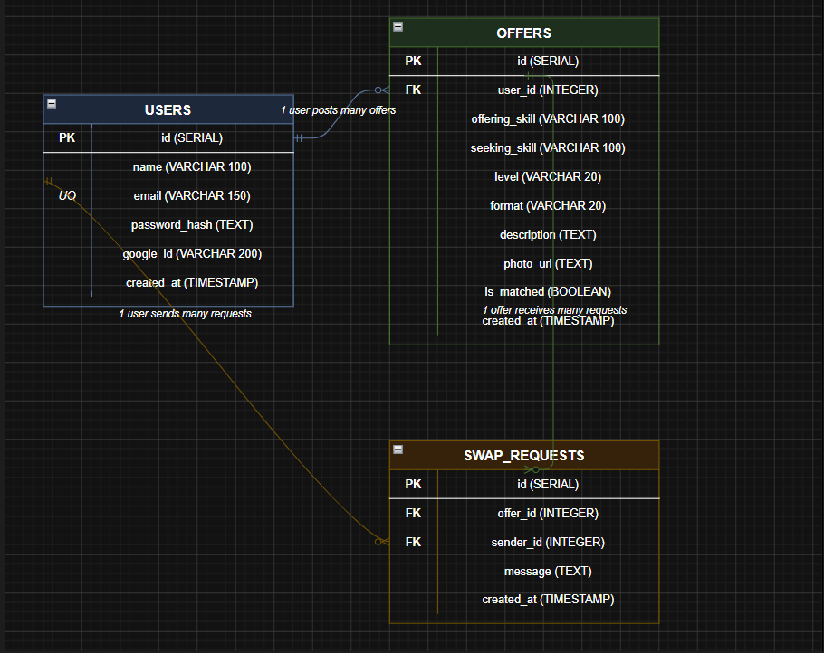

# SkillSwap 🔄

> A peer-to-peer skill exchange platform where people trade skills instead of money.

A developer teaches someone Python — that person teaches them Graphic Design in return. SkillSwap lets users post skills they can teach, skills they want to learn, and find matches in their community.

---

## Table of Contents
- [Project Description](#project-description)
- [Database Schema](#database-schema)
- [DDL — Table Creation SQL](#ddl--table-creation-sql)
- [API Endpoints](#api-endpoints)
- [Pages & Data Flow](#pages--data-flow)
- [Setup Instructions](#setup-instructions)
- [How to Run the Seed File](#how-to-run-the-seed-file)
- [Live URLs](#live-urls)
- [Known Limitations](#known-limitations)

---

## Project Description

SkillSwap is a fullstack peer-to-peer skill exchange platform built with:
- **Backend**: Node.js + Express.js REST API
- **Database**: PostgreSQL via Supabase
- **Authentication**: JWT + bcrypt for email/password, Passport.js for Google OAuth
- **Media Uploads**: Multer + Cloudinary
- **Frontend**: React + React Router + Axios
- **Deployment**: Backend on Render, Frontend on Vercel

### Core Features
- Sign up and log in with email/password or Google OAuth
- Post a SkillOffer — what you can teach and what you want to learn in return
- Browse and search all skill offers by keyword
- Send swap requests to offers you're interested in
- Offer owners can view incoming requests and mark their listing as Matched
- Edit and delete your own offers
- Rate limiting to protect the API from abuse
- Media uploads for profile photos via Cloudinary

---

## Database Schema



### Tables
| Table | Description |
|-------|-------------|
| `users` | Stores all user accounts (email/password and Google OAuth) |
| `offers` | Stores all skill exchange listings |
| `swap_requests` | Stores all swap requests sent to offers |

### Relationships
- A **User** can post many **Offers** → one-to-many
- An **Offer** can receive many **Swap Requests** → one-to-many
- A **User** can send many **Swap Requests** → one-to-many

### Why ON DELETE CASCADE?
If a user deletes their account, all their offers are automatically deleted. If an offer is deleted, all its swap requests are automatically deleted. This keeps the database clean with no orphaned records.

---

## DDL — Table Creation SQL

```sql
-- TABLE 1: users (created first — no dependencies)
CREATE TABLE users (
  id            SERIAL PRIMARY KEY,
  name          VARCHAR(100) NOT NULL,
  email         VARCHAR(150) UNIQUE NOT NULL,
  password_hash TEXT,
  google_id     VARCHAR(200),
  created_at    TIMESTAMP DEFAULT NOW()
);

-- TABLE 2: offers (created second — depends on users)
CREATE TABLE offers (
  id             SERIAL PRIMARY KEY,
  user_id        INTEGER NOT NULL REFERENCES users(id) ON DELETE CASCADE,
  offering_skill VARCHAR(100) NOT NULL,
  seeking_skill  VARCHAR(100) NOT NULL,
  level          VARCHAR(20) CHECK (level IN ('Beginner', 'Intermediate', 'Expert')),
  format         VARCHAR(20) CHECK (format IN ('Video Call', 'Async', 'In-person')),
  description    TEXT,
  photo_url      TEXT,
  is_matched     BOOLEAN DEFAULT FALSE,
  created_at     TIMESTAMP DEFAULT NOW()
);

-- TABLE 3: swap_requests (created last — depends on users AND offers)
CREATE TABLE swap_requests (
  id         SERIAL PRIMARY KEY,
  offer_id   INTEGER NOT NULL REFERENCES offers(id) ON DELETE CASCADE,
  sender_id  INTEGER NOT NULL REFERENCES users(id) ON DELETE CASCADE,
  message    TEXT NOT NULL,
  created_at TIMESTAMP DEFAULT NOW()
);

-- INDEXES for faster queries
CREATE INDEX idx_offers_user_id ON offers(user_id);
CREATE INDEX idx_swap_requests_offer_id ON swap_requests(offer_id);
CREATE INDEX idx_swap_requests_sender_id ON swap_requests(sender_id);
CREATE INDEX idx_offers_search ON offers
  USING GIN(to_tsvector('english', offering_skill || ' ' || seeking_skill || ' ' || COALESCE(description, '')));
```

### Why this order?
Tables must be created in dependency order. `users` has no foreign keys so it goes first. `offers` references `users` so it goes second. `swap_requests` references both `users` and `offers` so it goes last. Creating them out of order causes a PostgreSQL error.

---

## API Endpoints

**Base URL (Development):** `http://localhost:5000`
**Base URL (Production):** `https://your-app.onrender.com`

### Auth Routes
| # | Method | Path | Auth | Description |
|---|--------|------|------|-------------|
| 1 | POST | /api/auth/register | No | Register new user, returns JWT |
| 2 | POST | /api/auth/login | No | Login, returns JWT |
| 3 | GET | /api/auth/google | No | Initiate Google OAuth flow |
| 4 | GET | /api/auth/google/callback | No | Google OAuth callback, returns JWT |

### Offer Routes
| # | Method | Path | Auth | Description |
|---|--------|------|------|-------------|
| 5 | GET | /api/offers | No | Get all offers (supports ?format= and ?level= filters) |
| 6 | GET | /api/offers/search?q=keyword | No | Search offers by keyword |
| 7 | GET | /api/offers/:id | No | Get a single offer with request count |
| 8 | POST | /api/offers | Yes | Create a new offer |
| 9 | PUT | /api/offers/:id | Yes (owner) | Edit an offer |
| 10 | DELETE | /api/offers/:id | Yes (owner) | Delete an offer |
| 11 | PATCH | /api/offers/:id/match | Yes (owner) | Toggle matched status |

### Swap Request Routes
| # | Method | Path | Auth | Description |
|---|--------|------|------|-------------|
| 12 | POST | /api/offers/:id/request | Yes | Send a swap request |
| 13 | GET | /api/offers/:id/requests | Yes (owner) | View all requests on your offer |

### User Routes
| # | Method | Path | Auth | Description |
|---|--------|------|------|-------------|
| 14 | GET | /api/users/:id | No | Get user profile and their offers |

### HTTP Status Codes
| Code | Meaning |
|------|---------|
| 200 | OK — successful request |
| 201 | Created — new resource created |
| 400 | Bad Request — missing fields, self-request, or matched offer |
| 401 | Unauthorized — no token or invalid token |
| 403 | Forbidden — valid token but not the owner |
| 404 | Not Found — resource does not exist |
| 429 | Too Many Requests — rate limit hit |
| 500 | Internal Server Error |

---

## Pages & Data Flow

| Page | Path | Data Needed | API Call |
|------|------|-------------|----------|
| Feed | / | All offers | GET /api/offers |
| Single Offer | /offers/:id | One offer + request count | GET /api/offers/:id |
| Search Results | /search?q=keyword | Matching offers | GET /api/offers/search?q= |
| Sign Up | /register | None on load | POST /api/auth/register |
| Log In | /login | None on load | POST /api/auth/login |
| Create Offer | /offers/new | None on load | POST /api/offers |
| Edit Offer | /offers/:id/edit | Existing offer data | GET then PUT /api/offers/:id |
| My Requests | /offers/:id/requests | Incoming swap requests | GET /api/offers/:id/requests |
| User Profile | /users/:id | User info + their offers | GET /api/users/:id |

---

## Setup Instructions

### Environment Variables
Create a `.env` file in the `/backend` folder with the following:

```env
DATABASE_URL=your_supabase_connection_string
JWT_SECRET=your_jwt_secret_key
GOOGLE_CLIENT_ID=your_google_client_id
GOOGLE_CLIENT_SECRET=your_google_client_secret
CLOUDINARY_CLOUD_NAME=your_cloudinary_cloud_name
CLOUDINARY_API_KEY=your_cloudinary_api_key
CLOUDINARY_API_SECRET=your_cloudinary_api_secret
PORT=5000
```

> ⚠️ Never commit your `.env` file. It is listed in `.gitignore`.

### Installation

**1. Clone the repository**
```bash
git clone https://github.com/your-username/skillswap.git
cd skillswap
```

**2. Install backend dependencies**
```bash
cd backend
npm install
```

**3. Install frontend dependencies**
```bash
cd ../frontend
npm install
```

**4. Set up the database**
- Create a free account at [supabase.com](https://supabase.com)
- Create a new project
- Go to the SQL Editor
- Paste and run the contents of `schema.sql`

**5. Run the seed file**
```bash
cd ../backend
node seed.js
```

**6. Start the backend**
```bash
cd backend
npm start
```

**7. Start the frontend**
```bash
cd frontend
npm run dev
```

The backend runs on `http://localhost:5000`
The frontend runs on `http://localhost:5173`

---

## How to Run the Seed File

The seed file pre-populates the database with realistic data so the app doesn't look empty on first load.

```bash
cd backend
node seed.js
```

This creates:
- 3 fictional user accounts
- 10+ skill offers across different skill pairs
- 1-2 swap requests on each offer

> ⚠️ Make sure your `DATABASE_URL` is set in `.env` before running the seed file.

---

## Live URLs
| | URL |
|--|-----|
| **Frontend** | https://skillswap-sable-xi.vercel.app |
| **Backend API** | https://skillswap-pumw.onrender.com |
---

## Known Limitations

- Google OAuth callback URL must be updated in Google Cloud Console when switching between development and production environments
- Photo uploads are optional — offers without photos display a placeholder avatar
- Search is case-insensitive but requires at least one matching word in offering_skill, seeking_skill, or description
- Free tier on Render spins down after inactivity — first request after idle may take 30-60 seconds to respond

Frontend: https://skillswap-sable-xi.vercel.app
Backend: Runs locally during demo